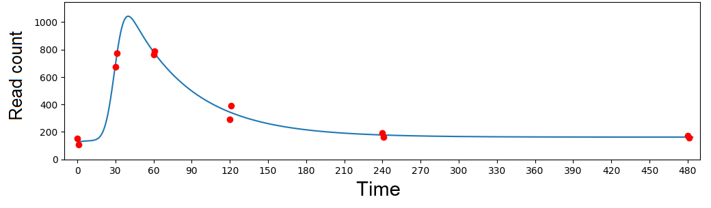
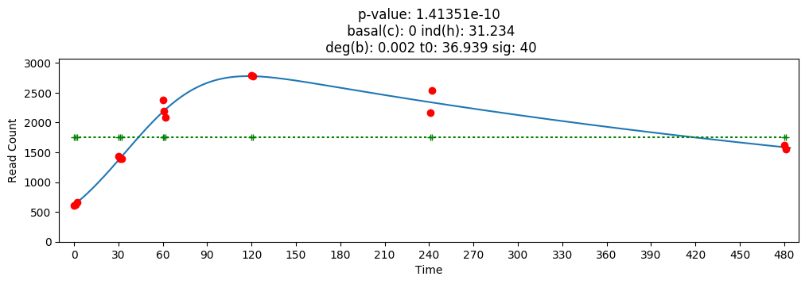

# Genes Shape (GS) Model

Contains python code which identify genes behavior and enable us to choose genes we "believe"

sources - deseq2 files (results of stage 1)

results - fit for each gene (for all experiments)

**5 parameters :**

- C - basel level
- H - induction height
- B - degradation rate
- T0 - peak time
- Sigma - peak width

real_y - is the real values fit

real_y + 10 - is a noises by adding ~normal(10,2) (not used at the moment)

P-value of the fit

## Examples for Some fits :

red dots - actual gene expression (few repeats at the same time)

blue line - the fit predicted by our GS model

