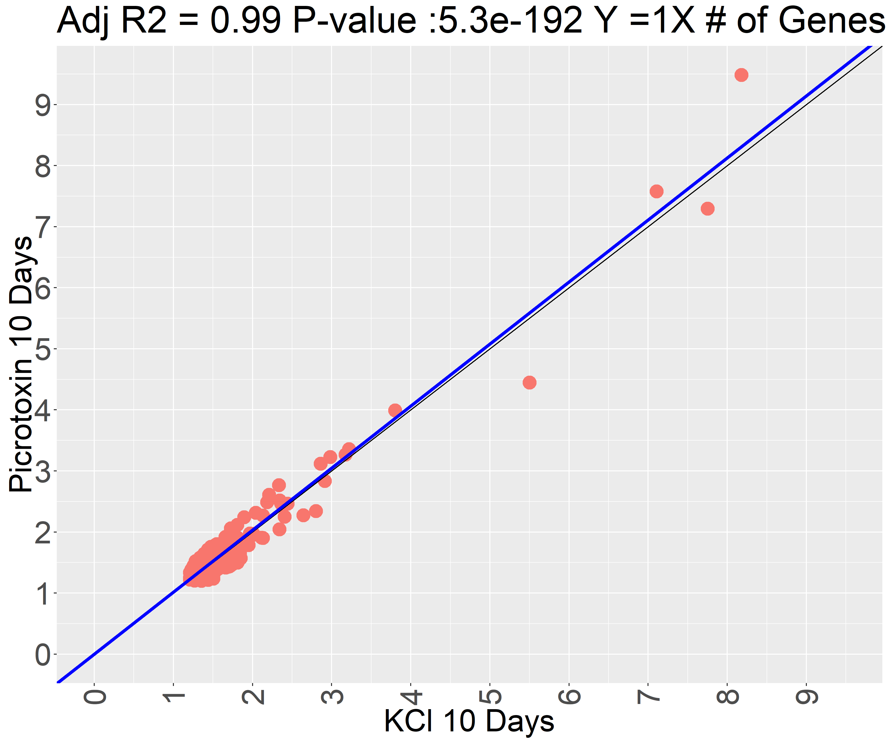
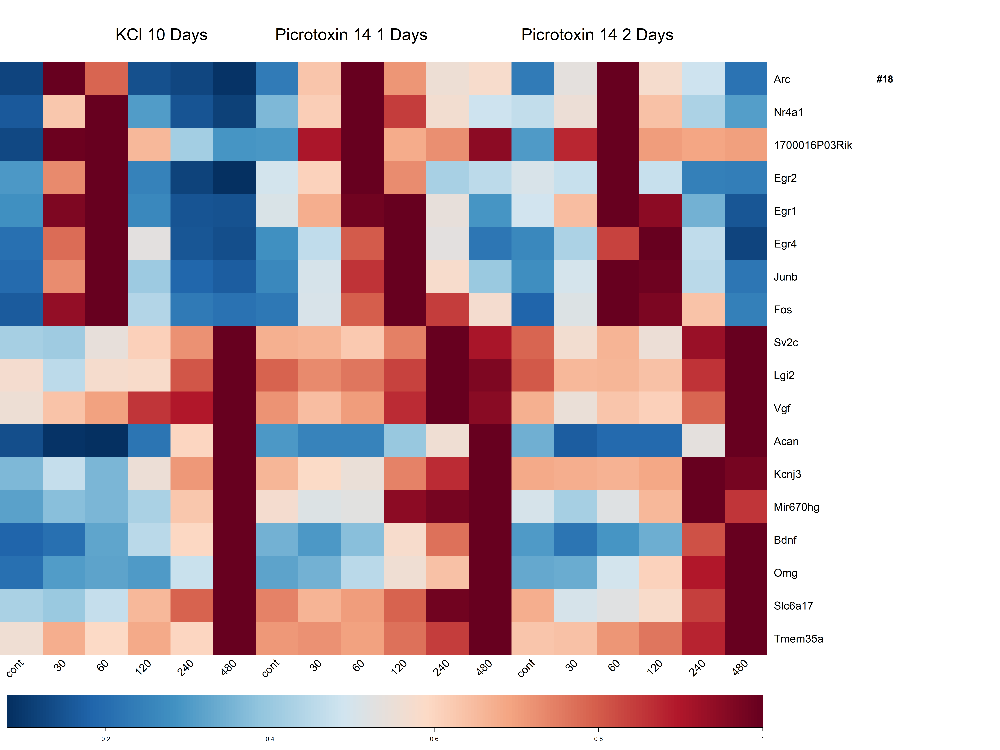

# Clustering

**clusters  - pairwise** : clusters from a pairwise comparison between experiments.

## create_gene_set_#1.R

Loads data sets, filter out genes which don’t pass (0.1 + 1.2 FC)

Create two gene groups:

- kcl 10 and pic 10 & 14 1
- Pic 14 1&2

## clusters_part#2.R

1. Find fit between experimenets common genes
2. Divide each pairwise fit into clusters

Each comparison have 9 clusters

1. kcl 10 pic 10
2. Pic 14 1 pic 10
3. Pic 14 2 pic 14 1
4. Kcl 10 to pic 14 1

## gene_ont#3.R

use GSEA gene ontology to find clusters main terms

[https://www.gsea-msigdb.org/gsea/index.jsp](https://www.gsea-msigdb.org/gsea/index.jsp)

Example for pairwise fit :

Example for Heatmap comparison between 3 different experiments 

